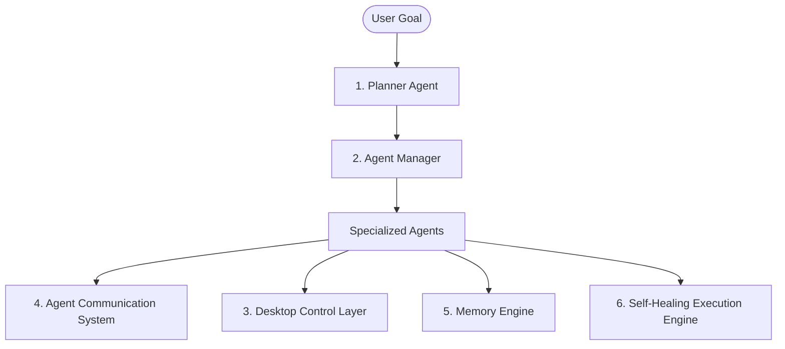

# Project Vision: Autonomous Multi-Agent Desktop Operating System

## Overview

We are building an **Autonomous AI Agent Operating System** that transforms a user's natural language goal into a fully executable workflow capable of controlling the desktop, browser, applications, files, and online services without requiring manual workflow creation.

Unlike traditional automation platforms such as n8n or Zapier, where users must manually design workflows, our platform automatically analyzes the user's objective, generates an optimized workflow, creates specialized AI agents, and executes tasks autonomously.

The platform acts as a digital workforce where multiple AI agents collaborate, communicate, and adapt in real time to accomplish complex goals.

---

## Problem Statement

Current automation tools require deep technical knowledge and manual workflow design. Users must decide:
- What steps are needed
- Which tools to use
- How tasks should be connected
- How to handle failures and edge cases

This creates a significant barrier for non-technical users and limits the true potential of AI automation. Users should be able to simply describe their goal and allow the AI to determine the execution strategy.

---

## Proposed Solution

The system introduces an **AI Orchestrator** that acts as a project manager. 

When a user provides a goal such as:
> *"Research 100 startups, collect founder emails, generate personalized outreach messages, send emails, and create a report."*

The platform will:
1. **Analyze** the objective and constraints.
2. **Break** it into smaller, manageable tasks.
3. **Generate** an execution workflow plan.
4. **Create/Instantiate** specialized AI agents dynamically.
5. **Assign** responsibilities to each agent.
6. **Execute** tasks across the desktop and web using specialized tools.
7. **Monitor** progress and coordinate state sharing.
8. **Self-heal** and recover from failures automatically.
9. **Present** final results and reports to the user.

---

## Core Architecture

The operating system is built on six foundational pillars:

### 1. Planner Agent
Responsible for:
- Understanding user intent, constraints, and success criteria.
- Breaking goals down into structured execution steps (a task dependency graph).
- Optimizing workflows and updating plans dynamically based on feedback.

### 2. Agent Manager
Creates and manages specialized agents dynamically. Agents are spawned as needed for the specific task requirements rather than being static components.
*Examples of dynamic agents:*
- **Research Agent**: Scrapes web directories, compiles leads, gathers domain intelligence.
- **Browser Agent**: Interacts with complex web apps, fills out forms, navigates dashboards.
- **Coding Agent**: Writes scripts to transform data, runs calculations, processes APIs.
- **Email Agent**: Formulates context-aware outreach emails and coordinates sending.
- **Reporting Agent**: Summarizes execution data, generates charts, builds PDF/Excel sheets.

### 3. Desktop Control Layer
Provides AI with secure, controlled access to:
- Keyboard and mouse control (OS GUI interaction).
- Active web browsers (via Playwright / Selenium / native hooks).
- The file system (reading/writing documents, spreadsheets, code).
- Standard applications and command-line interfaces.

### 4. Agent Communication System
A message-passing and shared-state system that allows agents to collaborate.
*Example interaction workflow:*
1. **Research Agent** finds leads and stores them in shared memory.
2. **Email Agent** retrieves lead details, requests business context from the user/memory.
3. **Research Agent** supplies missing context.
4. **Email Agent** drafts and queues personalized emails for review.

### 5. Memory Engine
Maintains system-wide knowledge including:
- **Short-term Memory**: Active task states, variables, and messages exchanged during a run.
- **Long-term Memory**: User preferences, successful workflow templates, past execution history, and learnings from failures.

### 6. Self-Healing Execution Engine
Uses computer vision (OCR, object detection) and LLM reasoning to navigate dynamic interfaces. If a button's location changes or label changes (e.g., from "Login" to "Sign In"), the vision/semantic layer identifies the target and adapts the action without crashing.

---

## Key Features

- **Autonomous Workflow Creation**: Zero-setup automation. Just describe the objective.
- **Multi-Agent Collaboration**: Parallel and sequential execution where agents divide and conquer.
- **Cross-App Desktop Automation**: Native interaction with legacy desktop apps and web tools.
- **Continuous Monitoring Agents**: Long-running background workers that poll, watch files, or track sites.
- **Human-in-the-Loop Approval System**: Guardrails for sensitive actions (payments, sending emails, deleting data).
- **Agent Marketplace / Registry**: Extensible catalog of pre-trained agents and custom tool definitions.
- **Multi-Device Distribution**: Ability to scale agent tasks to cloud instances, local machines, or secure VMs.

---

## Long-Term Vision

The ultimate destination is the **AI Workforce Operating System**. Instead of using individual software tools to compile lists, write emails, and generate documents manually, users will hire digital worker teams. 

These digital employees will negotiate tasks, collaborate seamlessly, resolve issues dynamically, and continuously optimize their output. The platform acts as the core substrate orchestrating this workforce.
